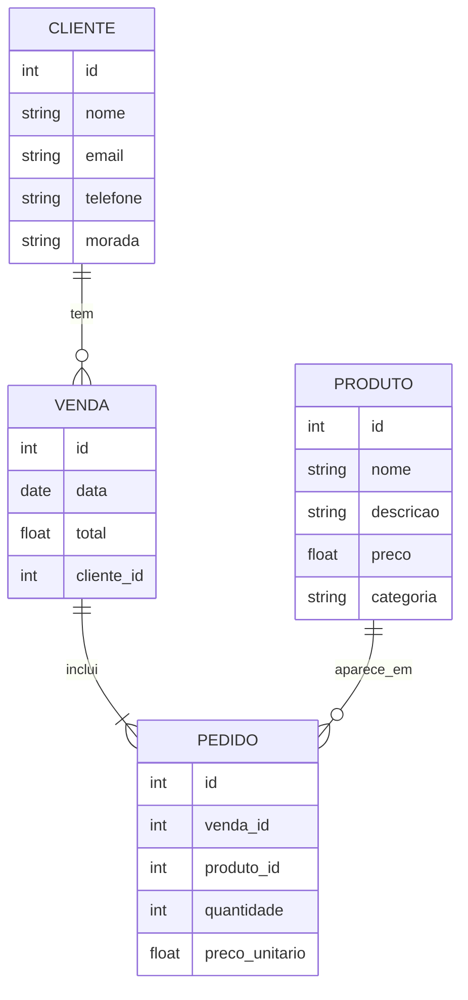

```mermaid
erDiagram
  CLIENTE ||--o{ VENDA : tem
  VENDA ||--|{ PEDIDO : inclui
  PRODUTO ||--o{ PEDIDO : aparece_em

  CLIENTE {
    int id
    string nome
    string email
    string telefone
    string morada
  }

  PRODUTO {
    int id
    string nome
    string descricao
    float preco
    string categoria
  }

  VENDA {
    int id
    date data
    float total
    int cliente_id
  }

  PEDIDO {
    int id
    int venda_id
    int produto_id
    int quantidade
    float preco_unitario
  }
```
